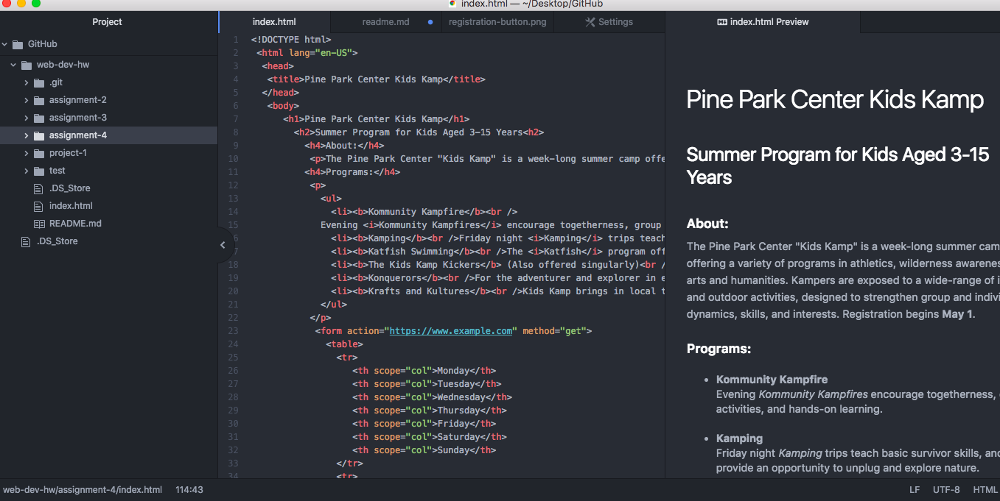

# Technical Support
Alt text is an attribute. Alt text text provides alternative terms for search engines. This makes the the document you are working on and the information in the alt text easier to find through web searches.

Most of the forms I have come across while browsing the internet are through search engines and boxes. The purpose of a form element is to collect data from the user through the website.

My work cycle during this project went well. I feel that I made progress in terms of including more elements within my document. I really enjoyed learning how to implement form elements because it provides more possibilities and interactivity for my assignments.

