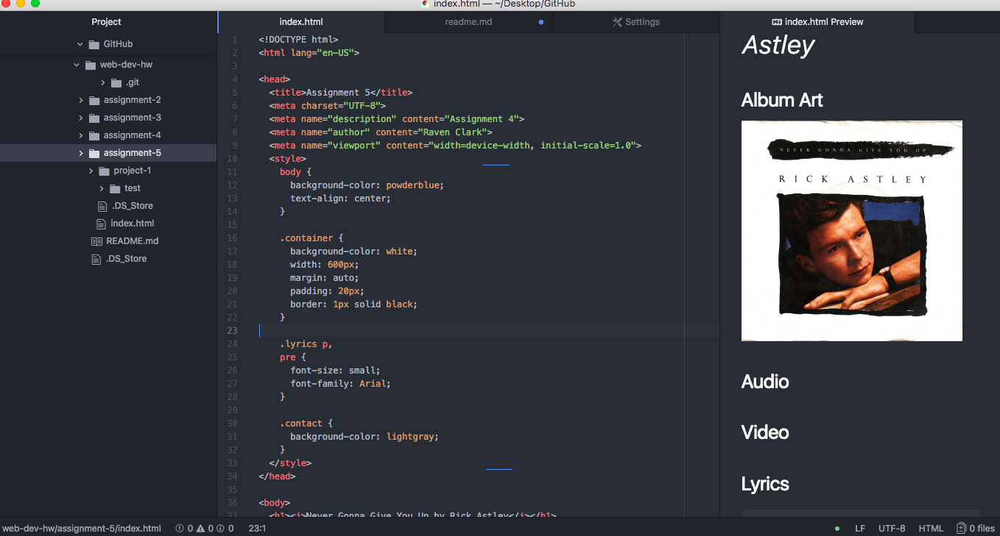

# Technical Support

Div elements allows developers to group elements together to create a block. Class attributes group similar types of elements and is more specific than div elements. ID elements refer to more unique attributes of the informations, which allows for unique elements to be grouped together. Span elements are the same as div elements, but are inline, so they can function inside of a div element.

You might consider third-party over self-hosted media because self-hosted media uses a lot of bandwidth and space, which could cause a site to run slowly. Third-party hosted media is a good alternative to save space and cost.

My work cycle for this assignment was more challenging than the last projects. The media linked in the assignment wasn't opening for me so I had to find the included media online. (I hope it is all the right media!) In addition, I was unable to preview my work in atom, so that set me back initially. I enjoyed learning how to embed different types of media because that is an important element of a user friendly site.

