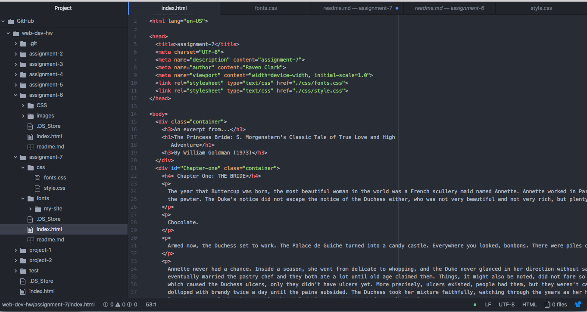

# Technical Report

My design process was pretty straight forward. I wanted to use tones that compliment each other, but are also legible. The fonts that I chose were not the most creative because I had a bit of difficulty understanding the embedding of fonts process. I mostly stuck with serif fonts.

A system fonts are fonts that are already installed on your device. Web fonts are custom and are hosted through the server. Web-safe fonts are fonts that are available on all systems (both Windows and MAC). Fall back fonts and font stacks are important because they allow for a stylized alternative font for the indicated text just incase the client is unable to display the initial font.

My work cycle for this project was not the best. I had a lot of trouble with this assignment because I didn't really understand how to import and embed fonts from the web. In addition, I was unsure what information to keep in my fonts.css versus my style.css files. Lastly, the problems with moodle only allowed me one day to finish up the last two assignments so I had to rush through the information, which caused me to not do my best. I wish these assignments would have been available on moodle weeks ago so I could have learned this information more thoroughly.

