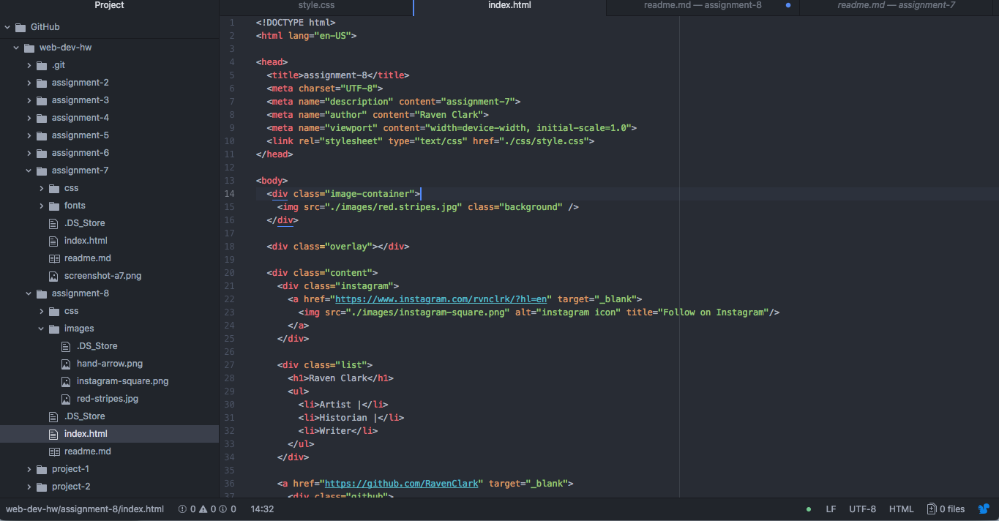

# Technical Report

Padding is the amount of space in between the inside content and the element which the content is in. Margin is the space between each box or element. Borders define the element as a whole.

The hardest task for me to accomplish during this assignment was creating a good layout where all of the elements were in the right space and had the right amount of padding. I think I eventually got the hang of it, but will need to keep practicing order to get it just right.

My work cycle for this assignment was good. I feel that having implemented some elements of the box model in past assignments really helped me to get through this assignment. I really enjoyed stylizing this page and creating a layout.

