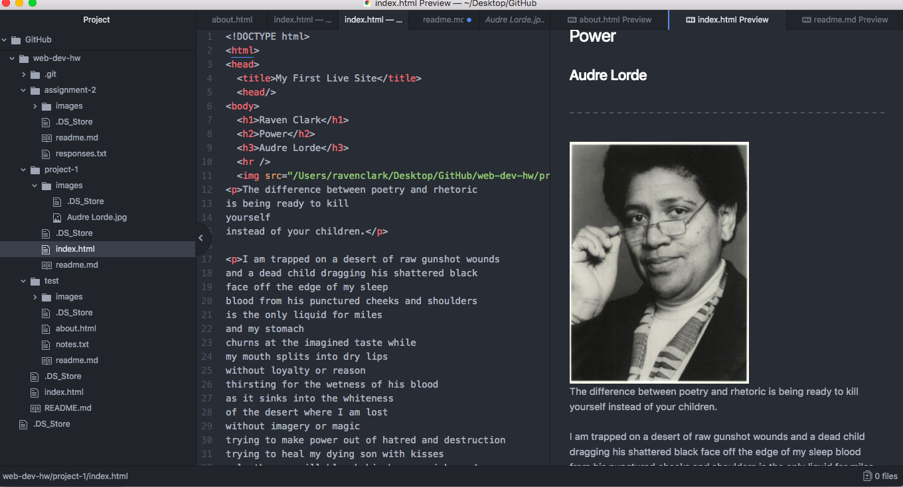

# Technical Report: Topic 3
I use google Chrome as my main web browser. A web browser functions by interpreting information that is sent from the network to the server and then returned.

Using the Wayback Machine I visited many sites including reference.com, imdb.com, and foodnetwork.com. In looking through the history of these sites I realize just how much they have changed. The sites now are much less simplistic and way more user friendly. In addition, these sites now have better navigation.

My work cycle for this project was relatively smooth. During this work cycle I feel like I finally understood a few things that I was having trouble with in the past, like embedding images. I am enjoying how each assignment requires us to implement the skills we've learned in previous lessons into our projects. It is helping me to continue to practice the things we have learned thus far.

