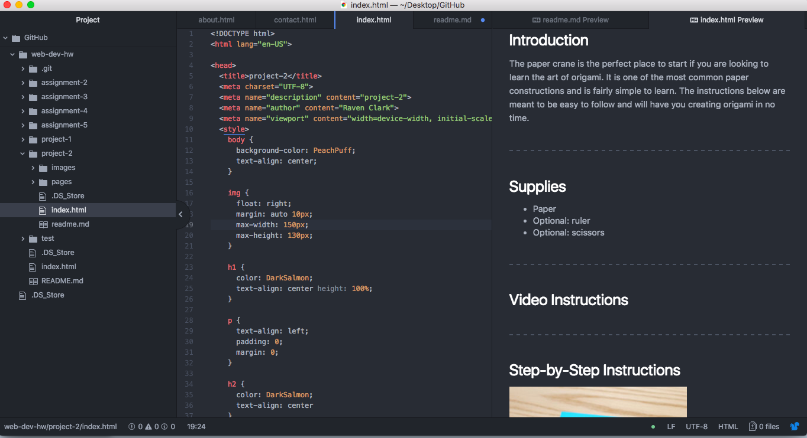

# Technical Report
My experience learning HTML was enlightening. Almost all of the information I learned was completely new to me. I found the bit of styling that we have learned thus far to be helpful and interesting. I am looking to learning more CSS in the next lesson. The thing that I found most difficult was aligning content on the page through divs.

I am very excited to learn CSS in the next lesson. I studio art student so I am looking forward to the more visual/ aesthetic side of web design. One thing that I would like to learn in terms of styling is the alignment of elements on a page. I would like to be able to break up the space of a page instead of stacking elements on top of each other.

My work cycle for project 2 was pretty fluent. I found it helpful that the assignment required me to work through the index file first and then move on to the other pages because it made my workflow more efficient. I had a bit of trial and error while trying to align things in a visually pleasing way, but eventually got the hang of it.

